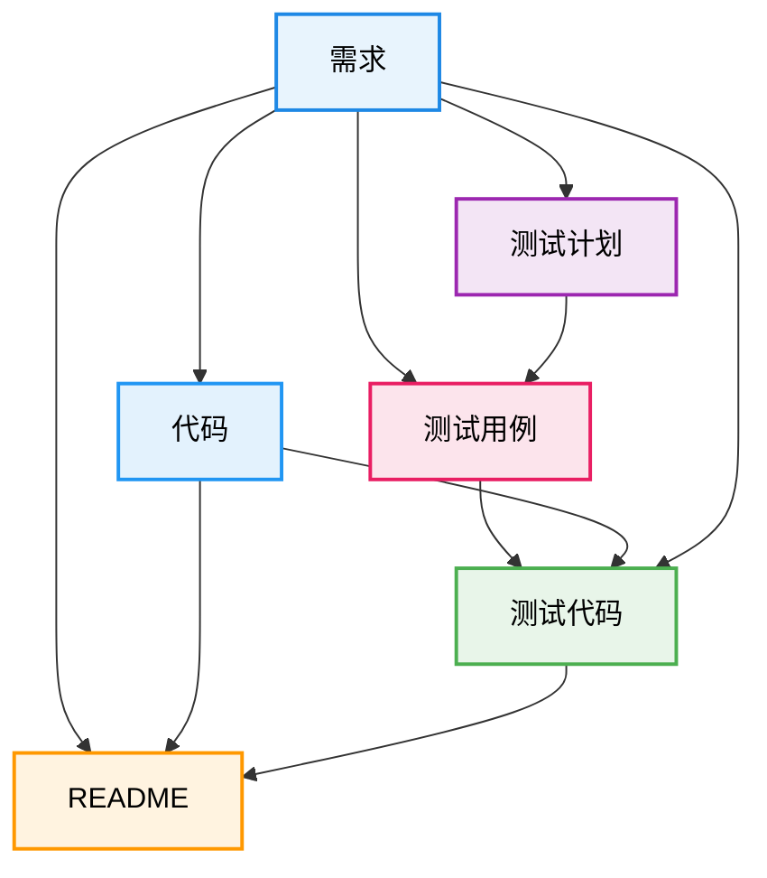

# 掼蛋计分器 (Guandan Scorer)

## 关于本项目

本项目完全基于 [Claude Code](https://claude.ai/code) 生成，通过AI驱动的开发流程，从需求分析到代码实现、测试用例编写，直至文档生成。

### 项目生成流程



- **需求**: [`需求.md`](需求.md) - 详细的功能需求和游戏规则说明（人工手写，多轮修订）
- **代码**: [`GuandanScorer/`](GuandanScorer/) - 包含所有Swift源代码
  - [`Models/GameScore.swift`](GuandanScorer/GuandanScorer/Models/GameScore.swift) - 游戏核心逻辑
  - [`Views/`](GuandanScorer/GuandanScorer/Views/) - 所有UI视图组件
- **测试计划**: [`testing_plan.md`](testing_plan.md) - 测试策略和范围
- **测试用例**: [`test_cases.md`](test_cases.md) - 详细的测试场景
- **测试代码**:
  - [`GuandanScorerTests/`](GuandanScorer/GuandanScorerTests/) - 单元测试
  - [`GuandanScorerUITests/`](GuandanScorer/GuandanScorerUITests/) - UI自动化测试
- **项目文档**: `README.md` - 本文档

## 项目简介

掼蛋计分器是一款专为iOS设备设计的应用程序，用于在打掼蛋扑克牌游戏时记录双方的级别和比分。该应用采用SwiftUI开发，提供直观的界面和完善的计分功能，支持游戏历史记录、统计分析等特性。

## 功能特点

### 核心功能

- **实时计分**：支持双贡、单贡、自贡等掼蛋游戏规则
- **级别系统**：完整支持2~10、J、Q、K、A1、A2、A3的级别进制
- **庄家系统**：自动追踪和转换庄家身份
- **游戏历史**：保存所有游戏记录，支持搜索和筛选
- **统计分析**：提供队伍胜率统计和排名功能
- **回退/前进**：支持游戏过程中的操作撤销和恢复

### 界面特性

- **深色模式**：支持iOS系统深色模式
- **横屏适配**：支持iPhone和iPad的横屏模式
- **适配性强**：支持iPhone 10及以后的所有机型

### 技术特点

- 使用Swift + SwiftUI开发
- 采用OSLogger进行日志记录
- 本地JSON文件存储游戏数据
- MVVM架构设计

## 系统要求

- iOS 15.0 或更高版本
- iPhone 10 及更新机型
- iPad（可选）

## 如何在Xcode中构建

### 前置要求

1. macOS系统（建议macOS Monterey 12.0或更高版本）
2. Xcode 14.0或更高版本
3. Apple开发者账号（部署到真机需要）

### 构建步骤

1. **克隆或下载项目**

```bash
git clone https://github.com/macgaf/guandan_scorer.git
cd guandan_scorer
```

2. **打开项目**

   - 启动Xcode
   - 选择 "Open a project or file"
   - 导航到项目目录，选择 `GuandanScorer/GuandanScorer.xcodeproj`
3. **配置签名（可选，真机调试需要）**

   - 在项目导航器中选择项目名称
   - 选择 "GuandanScorer" target
   - 在 "Signing & Capabilities" 标签页中
   - 勾选 "Automatically manage signing"
   - 在 "Team" 下拉菜单中选择你的开发者账号
4. **选择目标设备**

   - 在Xcode顶部工具栏，点击设备选择器
   - 选择模拟器（如iPhone 15 Pro）或连接的真机
5. **构建和运行**

   - 点击运行按钮（▶️）或按下 `Cmd + R`
   - 等待编译完成
   - 应用将在选择的设备上启动

### 常见构建命令

**清理构建缓存**

```bash
# 在Xcode中：Product -> Clean Build Folder
# 或使用快捷键：Shift + Cmd + K
```

**仅构建不运行**

```bash
# 在Xcode中：Product -> Build
# 或使用快捷键：Cmd + B
```

**运行测试**

```bash
# 在Xcode中：Product -> Test
# 或使用快捷键：Cmd + U
```

## 如何在iOS设备上部署

### 方法一：通过Xcode直接安装（开发调试）

1. **准备工作**

   - 确保iPhone/iPad通过USB线连接到Mac
   - 在iPhone上信任此电脑（首次连接时会提示）
   - 确保设备已解锁
2. **配置开发者账号**

   - 在Xcode中配置签名（见上文"配置签名"步骤）
   - 使用个人Apple ID即可（免费开发者账号）
3. **部署应用**

   - 在Xcode设备选择器中选择你的iOS设备
   - 点击运行按钮（▶️）
   - 等待编译和安装完成
4. **信任开发者证书**（首次安装需要）

   - 在iOS设备上：设置 -> 通用 -> VPN与设备管理
   - 找到开发者应用，点击信任

### 方法二：通过TestFlight分发（测试版本）

1. **创建Archive**

   - 在Xcode中选择 "Generic iOS Device" 作为目标
   - Product -> Archive
   - 等待归档完成
2. **上传到App Store Connect**

   - 在Archives窗口中选择刚创建的归档
   - 点击 "Distribute App"
   - 选择 "App Store Connect"
   - 按照向导完成上传
3. **配置TestFlight**

   - 登录App Store Connect网站
   - 选择你的应用
   - 进入TestFlight标签
   - 添加测试用户邮箱
4. **安装应用**

   - 测试用户在iOS设备上下载TestFlight应用
   - 接受测试邀请
   - 通过TestFlight安装应用

### 方法三：企业分发（需要企业开发者账号）

1. **创建IPA文件**

   - Product -> Archive
   - 选择 "Distribute App"
   - 选择 "Enterprise" 或 "Ad Hoc"
   - 导出IPA文件
2. **分发IPA**

   - 通过MDM系统分发
   - 或通过OTA（Over-The-Air）方式分发

## 项目结构

```
guandan_scorer/
├── GuandanScorer/
│   ├── GuandanScorer.xcodeproj   # Xcode项目文件
│   ├── GuandanScorer/
│   │   ├── GuandanScorerApp.swift # 应用入口
│   │   ├── Models/
│   │   │   ├── GameScore.swift    # 游戏模型和逻辑
│   │   │   └── OSLogger.swift     # 日志工具
│   │   └── Views/
│   │       ├── MainView.swift     # 主视图
│   │       ├── HomeView.swift     # 首页
│   │       ├── GameView.swift     # 游戏界面
│   │       ├── NewGameView.swift  # 新建游戏
│   │       └── StatsView.swift    # 统计界面
│   └── GuandanScorerTests/        # 单元测试
└── README.md                       # 本文档
```

## 测试

### 测试框架

项目包含完整的测试套件，包括单元测试和UI测试：

- **单元测试**：使用Swift Testing框架
- **UI测试**：使用XCTest框架

### 运行测试

#### 运行所有测试

```bash
# 在Xcode中：Product -> Test
# 或使用快捷键：Cmd + U
```

#### 运行特定测试

1. 在项目导航器中，选择测试文件
2. 点击测试方法左侧的播放按钮
3. 或右键点击测试方法，选择"Run Test"

### 单元测试

位于 `GuandanScorerTests/SimpleGameTests.swift`

包含的测试用例：

- **简单双贡测试**：测试双贡操作的游戏逻辑
- **级别升级方法测试**：验证级别升级规则的正确性

#### 测试覆盖内容

- 游戏核心逻辑（双贡、单贡、自贡）
- 级别升级规则和限制
- 庄家转换机制
- 游戏状态管理

### UI测试

位于 `GuandanScorerUITests/` 目录

#### 主要测试文件

- `GuandanScorerUITests.swift`：主要UI测试用例
- `GuandanScorerUITestsExtended.swift`：扩展测试用例
- `GuandanScorerUITestHelpers.swift`：测试辅助方法
- `GuandanScorerUITestsLaunchTests.swift`：启动测试

#### UI测试用例覆盖

包含16个核心测试用例：

1. **TC_UI_001**：对局信息正确显示测试
2. **TC_UI_002**：搜索过滤功能测试
3. **TC_UI_003**：列表项点击导航测试
4. **TC_UI_004**：左滑操作测试（删除、再来一局）
5. **TC_UI_005**："来一局"按钮跳转测试
6. **TC_UI_006**：返回首页功能测试
7. **TC_UI_007**：队员姓名输入测试
8. **TC_UI_008**：庄家选择互斥性测试
9. **TC_UI_009**：输入完整性验证测试
10. **TC_UI_010**：开局按钮功能测试
11. **TC_UI_011**：取消按钮返回测试
12. **TC_UI_012**：队员姓名显示测试
13. **TC_UI_013**：当前级别显示测试
14. **TC_UI_014**：庄家标识显示测试
15. **TC_UI_015**：点击队伍区域弹出贡牌选择测试
16. **TC_UI_016**：双贡/单贡/自贡按钮功能测试

### 测试最佳实践

1. **测试前准备**

   - 确保模拟器或真机处于干净状态
   - 清理之前的测试数据
   - 关闭不必要的应用
2. **调试测试失败**

   - 查看测试报告中的失败原因
   - 使用断点调试测试代码
   - 检查UI元素的accessibility标识符
3. **持续集成**

   - 可以配置GitHub Actions或其他CI工具
   - 在每次提交时自动运行测试
   - 确保代码质量

### 测试覆盖率

查看测试覆盖率：

1. 在Xcode中：Product -> Scheme -> Edit Scheme
2. 选择Test -> Options
3. 勾选"Gather coverage for"
4. 运行测试后，在Report Navigator中查看覆盖率报告

## 开发调试

### 日志查看

应用使用OSLogger记录详细的运行日志，包括：

- 界面加载和切换
- 用户操作（点击、滑动）
- 游戏状态变化
- 数据存储操作

在Xcode中运行时，可以在控制台查看实时日志输出。

### 数据存储

游戏数据以JSON格式存储在应用沙盒的Documents目录中：

- 文件名：`games.json`
- 路径：`Documents/games.json`

## 注意事项

1. **免费开发者账号限制**

   - 应用有效期为7天，需要重新安装
   - 最多同时安装3个应用
   - 不能使用某些高级功能
2. **性能优化**

   - 建议在真机上测试性能
   - 模拟器可能无法准确反映实际性能
3. **数据备份**

   - 应用数据存储在本地
   - 卸载应用会删除所有数据
   - 建议定期备份重要游戏记录

## 许可证

本项目仅供学习和个人使用。

## 项目地址

- **GitHub仓库**: https://github.com/macgaf/guandan_scorer
- **问题反馈**: https://github.com/macgaf/guandan_scorer/issues

## 联系方式

如有问题或建议，请通过[项目Issue页面](https://github.com/macgaf/guandan_scorer/issues)反馈。
